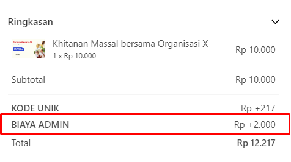

# Biaya Tambahan saat Checkout



Kamu bisa menambah biaya tambahan saat checkout, ini berguna untuk penambahan biaya admin, baik saat donasi
ataupun saat transaksi barang. ikut langkahnya berikut ini


1. Buka `wp-admin` website kamu
2. lalu pilih ke Appearance/Tema, pilih sub menu `Editor Tema`
3. lalu pilih tema yang sedang kamu gunakan, dan pilih file functions.php
4. setelah itu masukan kode berikut ini
5. lalu simpan.

``` php
add_action("init", function(){
    lwp_add_transaction_extras( "admin-fee", __( "Biaya Admin",'',  "lwdonation" ),2000, "+", "fixed", "total" );
});
```

Kamu bisa menyesuaikannya sesuai dengan keinginan kamu, baik teks ataupun nominalnya, 
serta operatornya, mau ditambah atau dikurang. 