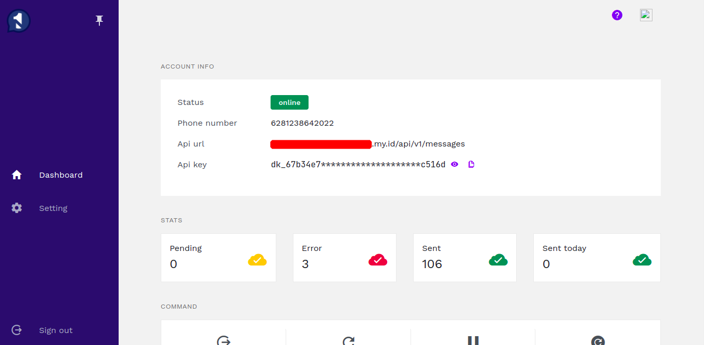
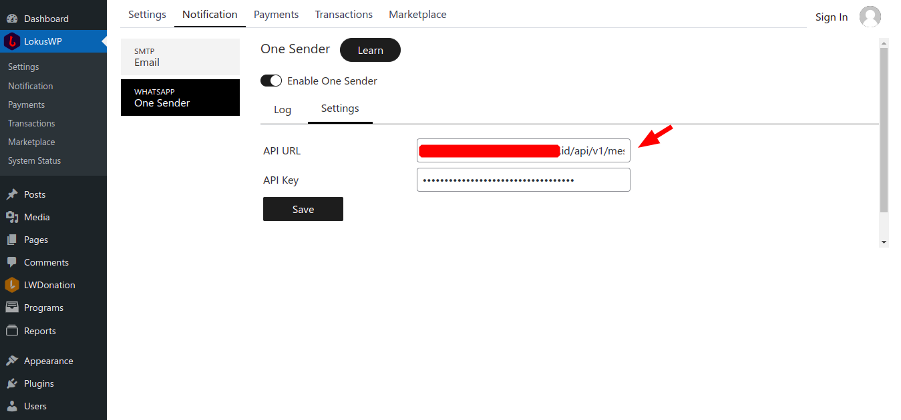

# LokusWP x OneSender

OneSender merupakan layanan notifikasi whatsapp untuk pengiriman pesan melalui whatspap secara otomatis, dengan menghubungkan whatsapp anda dengan aplikasi onesender, anda dapat mengirim pesan secara otomatis. berbeda dengan layanan whatsapp lainnya, dengan OneSender anda dapat menginstall aplikasinya di server anda sendiri.

## Beli Lisensi OneSender

Untuk dapat menggunakan OneSender anda perlu membeli terlebih dahulu, [Beli OneSender disini.](https://onesender.net/)\
Jika telah membeli anda akan diarahkan ke halaman member, disana anda bisa mengakses device OneSender.

### 1. Hubungkan/Pairing Whatsapp anda Dengan OneSender

### 2. Ambil Domain dan API Key

Setelah melakukan pairing, kamu bisa kembali ke halaman **Device** lalu lihat section **Account Info**

## Install Addon OneSender

Anda dapat menginstall wablas melalui Marketplace caranya.

1. Buka Halaman Admin **websiteanda.com/wp-admin**
2. Pilih **LokusWP** > **Marketplace**
3. Lalu pilih **LokusWP x OneSender**
4. Klik **Unduh dan Aktifkan**
5. Tunggu proses download, sampai addon terinstall

## Konfigurasi OneSender di LokusWP

Setelah menginstall mendaftar akun Wablas, dan Menginstall Addon Wablas, langkah selanjutnya adalah melakukan konfigurasi, agar bisa terintegrasi

1. Buka Halaman Admin **websiteanda.com/wp-admin**
2. Pilih **LokusWP** > **Notifikasi** > **OneSender** > **Settings**
3. Lalu tempel **API URL** dari One Sender, dan\
   juga **API Key** ke Bidang/Field yang sudah disediakan
4. Klik **Simpan**

lihat gambar dibawah ini jika merasa kurang jelas.

Selesai, Sekarang Sistem sudah Bisa mengirim notifikasi otomatis ke Whatsapp Pengguna.,

<!-- ## Pengujian

Akan segera hadir. -->

