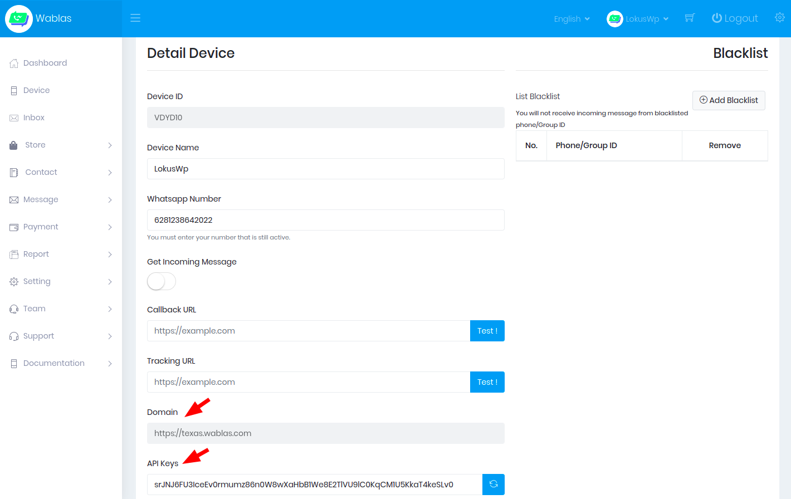
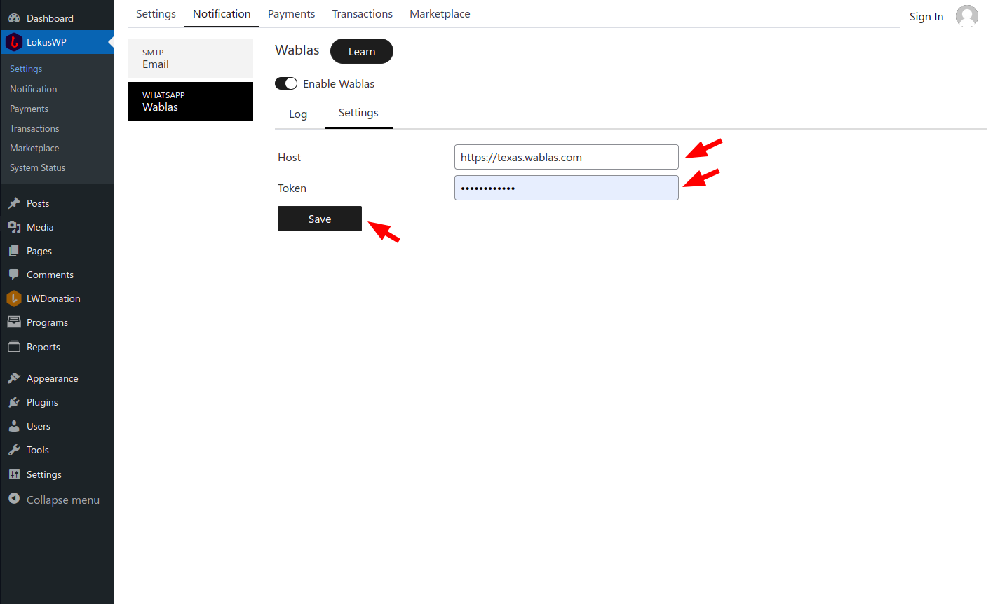

# LokusWP 🤝 Wablas

Wablas merupakan layanan notifikasi whatsapp untuk pengiriman pesan melalui whatspap secara otomatis, dengan menghubungkan whatsapp anda dengan aplikasi wablas, anda dapat mengirim pesan secara otomatis.

## Daftar Akun Wablas

Untuk bisa menggunakan wablas anda perlu mendaftar akun terlebih dahulu, [daftar wablas disini.](https://wablas.com/register)\
Jika telah mendaftar, masuk ke halaman dashboard wablas dan ikut langkah berikut ini.

### 1. Hubungkan/Pairing Whatsapp anda Dengan Wablas

<iframe width="560" height="315" src="https://www.youtube.com/embed/LXvykHawhkI" title="YouTube video player" frameborder="0" allow="accelerometer; autoplay; clipboard-write; encrypted-media; gyroscope; picture-in-picture" style="margin-top:16px" allowfullscreen></iframe>

### 2. Ambil Domain dan API Key

Setelah melakukan pairing, kamu bisa kembali ke halaman **Device** lalu pilih menu **Edit** dan ambil domain serta api key seperti berikut ini.pm ru

## Install Addon Wablas

Anda dapat menginstall wablas melalui Marketplace caranya.

1. Buka Halaman Admin **website.com/wp-admin**
2. Pilih **LokusWP** > **Marketplace**
3. Lalu pilih **LokusWP x Wablas**
4. Klik **Unduh dan Aktifkan**
5. Tunggu proses download, sampai addon terinstall

## Konfigurasi Wablas di LokusWP

Setelah menginstall mendaftar akun Wablas, dan Menginstall Addon Wablas, langkah selanjutnya adalah melakukan konfigurasi, agar bisa terintegrasi

1. Buka Halaman Admin **website.com/wp-admin**
2. Pilih **LokusWP** > **Notifikasi** > **Wablas** > **Settings**
3. Lalu tempel Server di wablas, dan juga api key yang ada di wablas
4. Klik **Simpan**

lihat gambar dibawah ini jika merasa kurang jelas.

<!-- ## Pengujian

Akan segera hadir. -->

