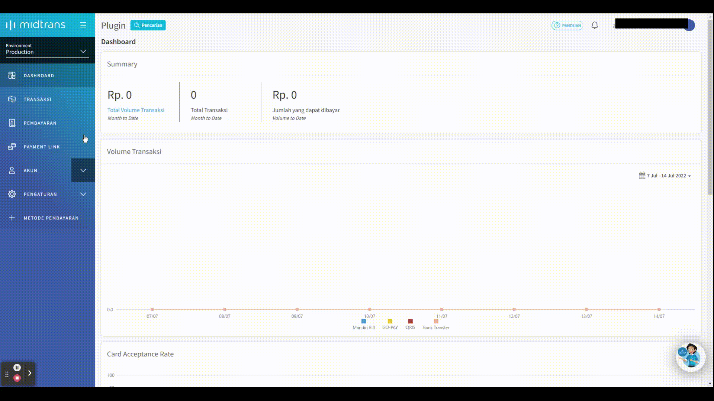

# LokusWP 🤝 Midtrans

 <Badge text="Goal"/> Dengan Integrasi ini anda dapat menerima pembayaran melalui midtrans dan dapat terkonfirmasi secara otomatis.

## 🛒 Mendapatkan Add-on Midtrans
Dapatkan add-on midtrans dengan cara membelinya di [link berikut ini](https://lokuswp.id/plugins/midtrans/) \
jika  pernah membeli, anda dapat melihatnya di halaman [member area](https://member.lokuswp.id).

## 👣 Langkah-Langkah Integrasi

Ikut langkah - langkah integrasi berikut ini dengan cermat

### 1. Cara Menginstall dan Aktifasi

Buka Menu **Marketplace** lalu pilih integrasi **LokusWP 🤝 Midtrans**
1. anda akan diarahkan ke halaman member
2. salin kode lisensi di member area -> license
3. tempel kode lisensi di halaman input lisensi
4. klik icon download

### 2. Melakukan Pendaftaran Akun Midtrans

Anda dapat melakukan pendaftaran melalui halaman ini [Daftar Akun Midtrans](https://dashboard.midtrans.com/register).

::: warning IMPORTANT
Jangan lupa untuk melakukan verifikasi akun sebagai usaha perorangan atau perseroan/yayasan, dan juga mengaktifkan metode pembayaran yang ingin digunakan. karena ini membutuhkan waktu.
:::

### 3. Membuat dan Memasang API Key

Anda perlu mendapatkan **Client Key** dan **Server Key** terlebih dahulu untuk dapat menghubungkan integrasi ini.
1. buka halaman [Pengaturan -> Access Key](https://dashboard.midtrans.com/settings/config_info)
   
2. masuk ke **wp-admin** website anda
3. pilih menu LokusWP > Payments > Integration > Midtrans > Paste Client Key & Server Key pada field yang disediakan
   
4. lalu simpan

## ✅ Pengujian

Setelah selelai melakukan pengaturan, anda dapat melakukan pengujian transaksi dan juga konfirmasi
secara otomatis, apakah sudah berjalan dengan sesuai.

### 1. Pembayaran

Klik Opsi Production jika akun anda sudah diverifikasi dan siap menerima uang asli\
Mode Non Production digunakan untuk keperluan pengujian saja.

Pilih Metode Pembayaran Midtrans, Lalu Klik Payment
Setelah itu KLik Bayar dengan Midtrans
Lalu lakukan pembayaran

### 2. Konfirmasi Otomatis

Jika anda sudah membayar, dan status transaksi otomatis berubah, maka
situs anda sudah siap.