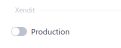

# Cara Integrasi LokusWP 🤝 Xendit

 <Badge text="Goal"/> Dengan Integrasi ini Situs anda dapat menerima pembayaran melalui xendit dan dapat terkonfirmasi secara otomatis.

## 🛒 Mendapatkan Add-on Xendit
Dapatkan add-on xendit dengan cara membeli di link berikut ini
jika sudah, anda dapat melihatnya di halaman member area

// Gif Pembelian Add-on

## 👣 Langkah-Langkah Integrasi

Ikut langkah - langkah integrasi berikut ini dengan cermat

### 1. Cara Menginstall dan Aktifasi

Buka Marketplace lalu pilih integrasi Xendit, setelah itu klik masuk ke member
lalu ambil kode lisensi yang ada di member area, inputkan ke input lisensi, lalu klik icon download

### 2. Melakukan Pendaftaran Akun Xendit

Anda dapat melakukan pendaftarn melalui halaman ini

::: warning IMPORTANT
Jangan lUpa lakukan verifikasi akun, dan aktifkan metode pembayaran
:::

### 3. Membuat dan Memasang Secret Token

Buka Halaman Xendit dan Buat Secret TOken
Pasang Secret Token di LokuSWP

### 4. Mengambil dan Mengatur Webhook

Ambil alamat Webhook di LokuSWP
lalu simpan di pengaturan webhook xendit

## ✅ Pengujian 

Anda perlu menguji terlebih dahulu pembayaran, agar anda mengetahui
bahwa anda sudah dapat menerima pembayaran melalui xendit

### 1. Pembayaran

Klik Opsi Production jika akun anda sudah diverifikasi dan siap menerima uang asli\
Mode Non Production digunakan untuk keperluan pengujian saja.

Pilih Metode Pembayaran Xendit, Lalu Klik Payment
Setelah itu KLik Bayar dengan Xendit
Lalu lakukan pembayaran

### 2. Konfirmasi Otomatis

Jika anda sudah membayar, dan status transaksi otomatis berubah, maka
situs anda sudah siap.

