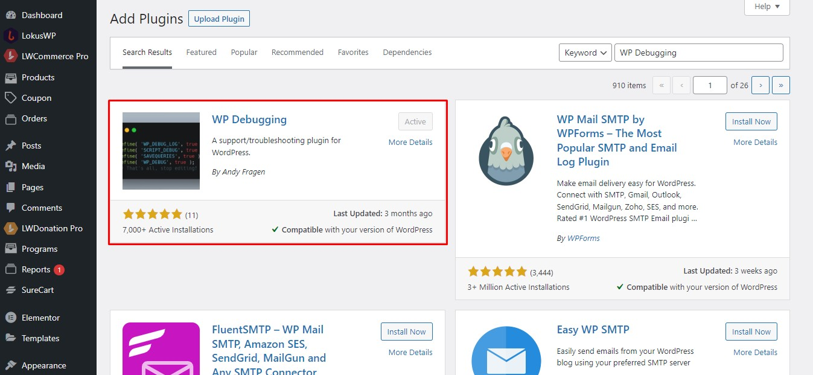
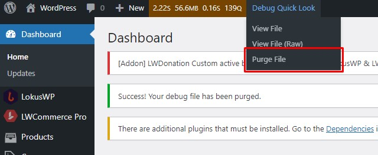
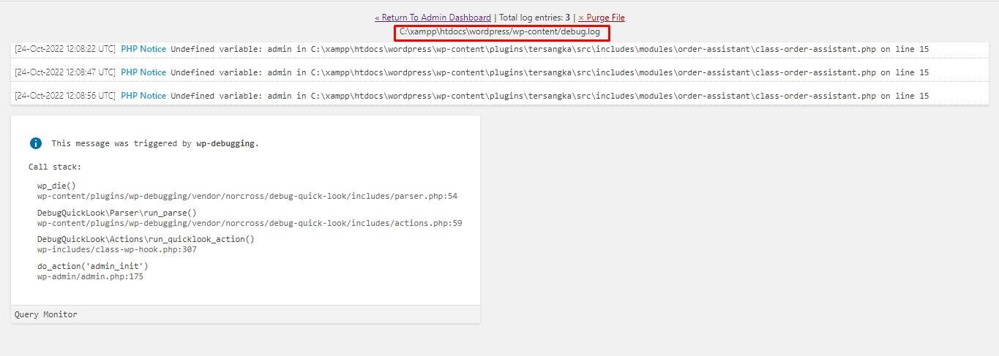

# Debugging

Debugging merupakan sebuah cara untuk kita bisa tau dari mana masalah / bug itu berasal.
berikut ini langkah-langkah melakukan debuggin di WordPress.

### 1. Download dan Install Plugin **WP Debugging**
Plugin ini berfungsi untuk mengaktifkan mode debugging di WordPress
dengan begitu kita bisa melihat dari mana masalah tersebut berasal.

### 2. Isolasi Masalah
Untuk lebih cepat menemukan masalah, kita perlu mengisolasinya dengan cara melakukan test
sesuai konteks masalahnya.\
Contoh :: **Tidak bisa checkout**\
berarti konteks masalahnya saat melakukan checkout, untuk itu kita hanya perlu
melakukan test sambil debugging pada konteks checkout saja.

1. Hapus log debugging terlebih dahulu **[Purge File]** ( agar tidak bias dari plugin lain )

  

2. Lalu lakukan pengetesan konteks ( Contoh : Melakuakan Checkout )
3. kita bisa melihat bahwa error akan muncul sesuai dengan konteks yang kita lakukan 
4. kirim log error ke developer

