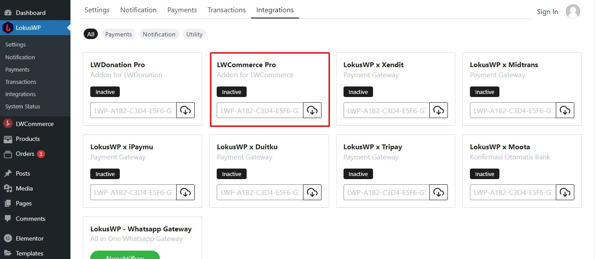

# Memulai

Terimakasih telah membeli addon LWCommerce, berikut ini adalah panduan
penggunaan LWCommerce Pro secara Optimal.

## Aktifasi

untuk bisa menggunakan addon Pro LWCommerce, pertama-tama kamu
perlu mendownload filenya di halaman member
lalu mengaktifkannya, dengan cara
1. buka wp-admin
2. pilih menu LokusWP > Integrations
3. cari `Addon Pro LWCommerce` 
4. lalu masukan kode lisensi, dan tekan tombol kunci
5. untuk mengaktifkan, dan tunggu proses aktifasi

Jika berhasil maka menu LWCommerce di wp-admin akan menjadi LWCommerce Pro