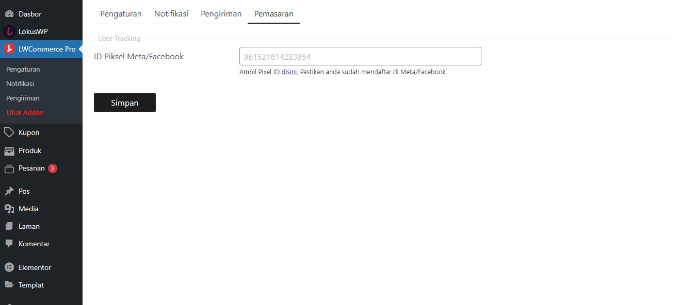

# Digital Marketing

## Atur Facebook Pixel
Untuk melakukan tracking penjualan pada website kamu bisa menambahkan Facebook Pixel ID
Caranya : 

1. Buka wp-admin
2. Pilih menu `LWCommerce Pro` 
3. Pilih Tab Pemasaran / Marketing
4. Lalu masukan Pixel ID

## Membuat Kupon
Untuk memberikan pengalaman dan diskon kepada pengguna, kamu bisa membuatnya sesuai kebutuhan
Terdapat 2 tipe diskon, Fixed dan juga Percentage ( Subtotal )

1. buka wp-admin
2. Pilih menu `Kupon`
3. klik tombol `Kupon Baru`
4. lalu masukan nama kupon, kode kupon dan pilihan pengaturan kupon

## Social Proof
Untuk lebih meyakinkan calon pembeli, kamu bisa mengaktifkan social proof. 
setiap orderan yang dibuat akan di tampilkan kepada calon pembeli
Cara mengaktifkannya :

1. buka wp-admin
2. Pilih menu `LWCommerce Pro`
3. Pilih tab Pengaturan > Penampilan ( Appearance )
4. Switch On Opsi `Social Proof`
5. Tekan Tombol Simpan