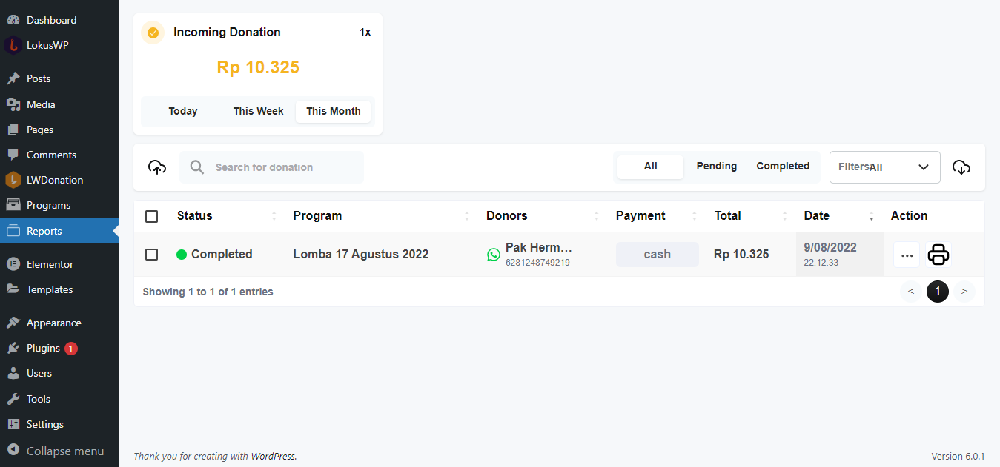

# Manajemen Laporan

Kamu bisa melakukan beberapa hal di halaman laporan donasi ini.

### Melihat Donasi ( Pencarian, Filter )

Kamu dapat mencari donasi dengan memasukan nama donatur di kotak pencarian, atau menampilkan donasi
dengan status pending, dengan menekan tombol pending pada header laporan.

### Konfirmasi Donasi Masuk

Anda bisa merubah status donasi dengan menekan tombol centang ✔️, ketika donatur sudah membayar, dengan begitu otomatis
notifikasi akan dikirimkan kepada donatur, bahwa donasi telah diterima, dan akan masuk ke tampilan transparansi donatur

### Export Laporan

Kamu bisa mengexport Laporan ke dalam bentuk CSV untuk backup, ataupun laporan bulanan.

### Import Laporan

Kamu bisa memasukan data laporan dari buku donasi manual, ke dalam sistem

