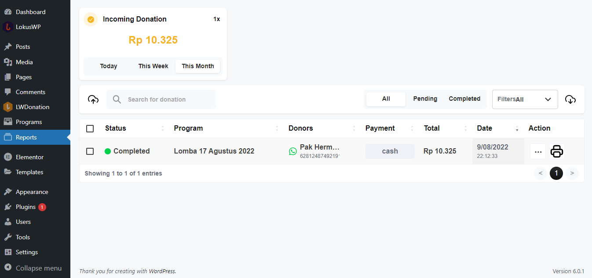

# Pengaturan Dasar Plugin

Setelah melakukan Instalasi dan Aktifasi Plugin maka anda bisa lanjut ke langkah
pengaturan dasar plugin, ini berguna agar plugin ini bisa menyesuaikan dengan organisasi anda.

Ada **7 Langkah Wajib** yang harus anda lakukan untuk mensetup plugin ini.

### 1. Menambah Program Donasi Pertama Anda.

Disini anda perlu menambah program donasi pertama anda, sesuai dengan tujuan website donasi ini
dibuat, anda bisa melihat cara menambah atau mengedit program donasi di bagian ini

[Cara Membuat atau Mengedit Program ]( ../lwdonation/program/create.md)

### 2. Melakukan Pengaturan Tampilan

Anda bisa menampilkan daftar program donasi dengan menggunakan shortcode yang tersedia di LWDonation
Jika anda masih awam apa itu shortcode anda bisa membaca terlebih dahulu artikel ini

[Apa itu Shortcode dan Cara Menggunakannya ](https://lokuswp.id/blog/apa-itu-shortcode)

Anda juga bisa mengkombinasikan plugin ini dengan Visual Builder yang anda suka, ataupun
menampilkannya di halaman tema yang sudah anda punya.

Anda juga bisa menonaktifkan dan mengaktifkan tampilan atau fitur-fitur tertentu
dari halaman ini

::: tip
Untuk lebih banyak variasi tampilan
anda bisa menambah addon [Pro ](https://lokuswp.id/plugins/lwdonation/pro) untuk LWDonation
:::

### 3. Melakukan Konfigurasi Notifikasi Email

Anda dapat melkukan konfigurasi subject yang dikirimkan ketika Notifikasi Email terkirim ke Donatur.

::: warning
Terdapat Fitur Email Editor, Untuk kemudahan mengatur template email yang ingin dikirim,
anda bisa menambah addon [Pro ](https://lokuswp.id/plugins/lwdonation/pro) untuk LWDonation
:::

### 4. Melakukan Konfigurasi Template Notifikasi Whatsapp

Untuk bisa menggunakan fitur notifikasi whatsapp anda wajib menggunakan add-on notifikasi whatsapp.
Anda bisa membaca dulu [Apa itu Notifikasi ](../lokuswp/notifikasi/index.md)

### 5. Melakukan Konfigurasi Metode Pembayaran

Anda bisa melakukan konfigurasi metode pembayaran yang ingin digunakan, atau anda juga bisa
menambah metode pembayaran baru dengan menggunakan add-on integrasi. 

Pelajari [Apa itu Pembayaran ]( ../lokuswp/pembayaran/index.md)

### 6. Melakukan Pengujian Donasi bagi User

Sebelum website donasi anda bisa mengudara, sangat wajib hukumnya anda melakukan testing apakah sistem
donasi sudah berjalan sesuai dengan keinginan anda atau belum. untuk itu anda perlu melakukan pengujian.

Anda bisa mengikuti daftar berikut ini jika sudah sesuai ekspektasi maka website donasi anda siap untuk dijalankan

| Aksi                                       | Ekspektasi                                        |
|:-------------------------------------------|:--------------------------------------------------|
| Membuka Daftar Program                     | ✔️ Melihat Daftar Program Terbaru                 |
| Melakukan Klik Pada Gambar Program         | ✔️ Diarahkan Ke Halaman Detail Program            |
| Melakukan Klik Pada Tombol Donasi Sekarang | ✔️ Menampilkan Pilihan Nominal Donasi             |
| Memilih Nominal Donasi                     | ✔️ Diarahkan Ke Halaman Checkout                  |
| Mengisi Data Diri dan Metode Pembayaran    | ✔️ Terdapat Validasi Jika Data Diisi Tidak Sesuai |
| Menekan Tombol Bayar saat Checkout         | ✔️ Menampilkan Halaman Instruksi Pembayaran       |
| -                                          | ✔️ Mendapatkan Notifikasi Email atau Whatsapp     |
| User melakukan Pembayaran                  | -                                                 |
| Admin mengganti status Laporan dibayar     | ✔️ Mendapatkan Notifikasi Donasi Berhasil         |

### 7. Melihat Dashboard Laporan

Anda bisa memantau donasi yang masuk di halaman dashboard laporan donasi anda. disini anda bisa konfirmasi donasi ( **Mengganti Status menjadi Sudah Di Bayar** ) 
Mengedit, dan melakukan Eksport atau Import data.

::: warning
Anda bisa membuat proses konfirmasi donasi ini menjadi otomatis tanpa perlu melakukan pengecekan ke rekening anda
 Caranya dengan menambah add-on Moota - Robot Cek Mutasi,  atau menggunakan add-on Payment Gateway seperti Midtrans, Xendit, dan Lainnya..
:::