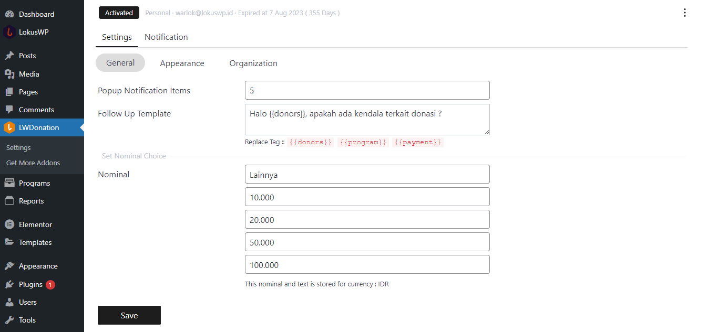

# Umum

Di Pengaturan Umum ini anda wajib mengisi data dari Organisasi anda, dan juga anda
bisa mengatur Pengaturan Umum.

Di Halaman ini kamu bisa

1. Mengatur jumlah item social proof yang ingin ditampilkan
2. Mengatur template Follow Up Whatsapp
3. Mengatur Nominal Donasi

### Data Organisasi / Lembaga

Kamu perlu mengisi data lembaga untuk keperluan sistem.

- Logo
- Nama
- Deskripsi
- Kategori

Lalu Data Profil Organisasi, untuk Keperluan Notifikasi
- Email
- Whatsapp

Lalu Data Alamat Organisasi
- Negara
- Alamat