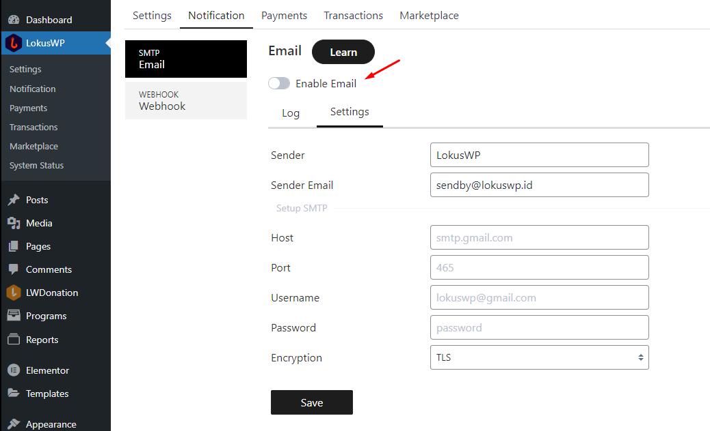

# Notifikasi Email

Untuk pengaturan notifikasi email anda dapat mengaktifkannya terlebih dahulu di LokusWP. 
jika website anda bisa mengirim email dengan baik, maka anda tidak perlu melakukan pengaturan SMTP.

Namun jika website anda tidak dapat mengirimkan Email ke alamat penerima, atau terkirim tapi sampai ke Folder SPAM
anda perlu mengatur SMTP Email terlebih dahulu.

::: tip
Untuk Mengetahui Website anda bisa mengirimkan email secara benar ke email penerima
anda bisa membaca artikel berikut ini [Cara Cek Email Terkirim di WordPress ]( https://lokuswp.id/blog/)
:::

Terdapat Beberapa Layanan SMTP ada yang Gratis yaitu menggunakan GMail
dan ada juga yang berbayar menggunakan [Mailketing ](https://bagil.ink/aff?affid=4493)

Jika anda sudah punya SMTP anda bisa melakukan konfigurasi di halaman 
**LokusWP > Notification > Email > Settings**

