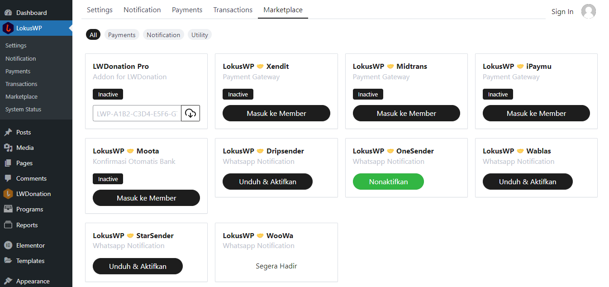
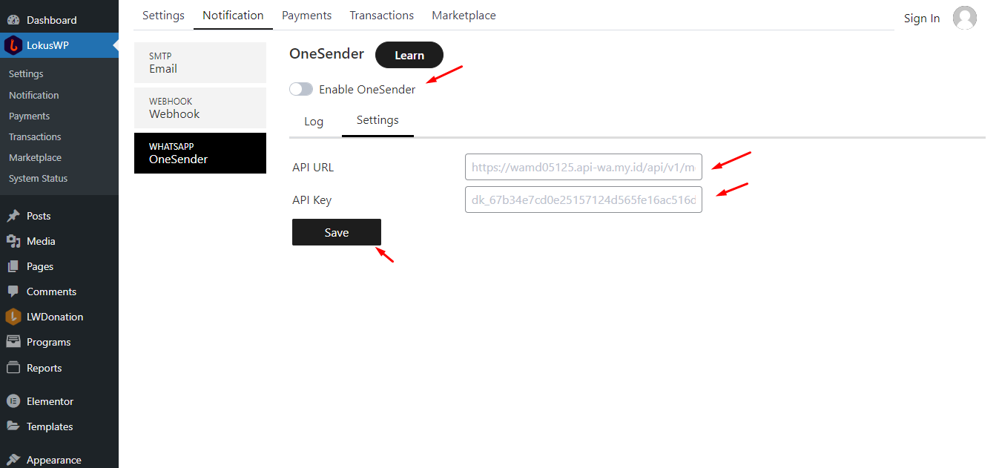

# Notifikasi Whatsapp

Untuk pengaturan notifikasi whatsapp anda dapat memasang add-onnya terlebih dahulu dari marketplace.
Jika sudah terinstall, maka akan muncul menu Notifikasi Whatsapp di LokusWP dan Template Notifikasi di app plugin.

### Menginstall Addon Notifikasi

::: warning
Notifikasi Whatsapp ini memerlukan biaya tambahan, anda perlu membayar ke vendor yang anda gunakan integrasi,
addon ini hanya untuk menyambungkan Whatsapp Gateway dengan sistem LokusWP.
:::

Kamu bisa menginstall addon notifikasi whatsapp Gratis yang tersedia di Marketplace, untuk konfigurasi integrasi notifikasi
kamu bica baca di Pengaturan Notifikasi LokusWP.

### Melakukan Konfigurasi Notifikasi

Kamu bisa mengatur konigurasi notifikasi, berikut ini adalah contoh konfigurasi notifikasi whatsapp dengan OneSender

Untuk panduan lebih lengkap kamu bisa baca [Apa itu Notifikasi]( ../../lokuswp/notifikasi/)