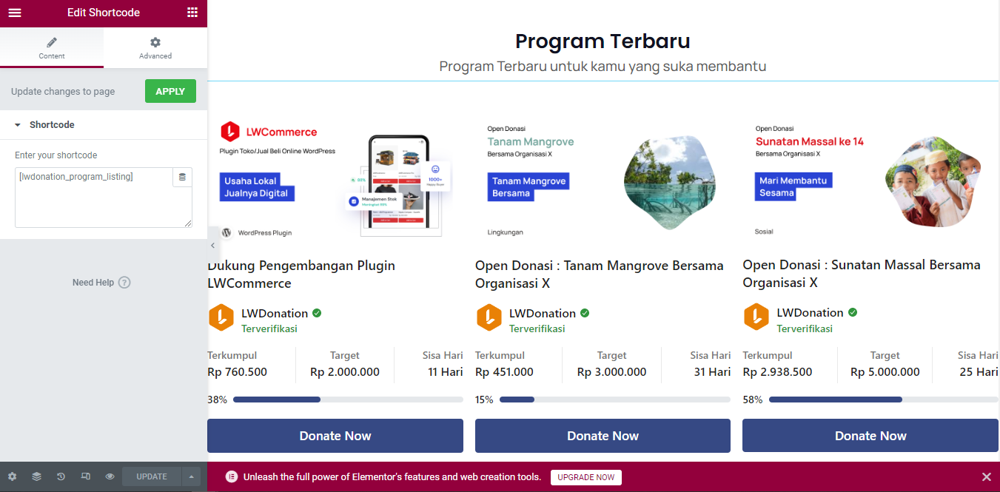
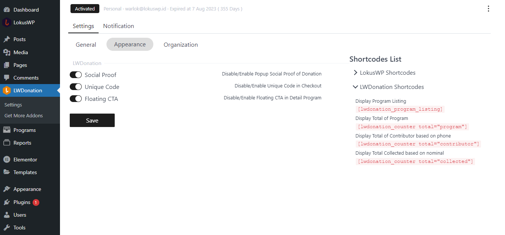

# Tampilan

Anda bisa menampilkan daftar program donasi dengan menggunakan shortcode yang tersedia di LWDonation
Jika anda masih awam apa itu shortcode anda bisa membaca terlebih dahulu artikel ini

[Apa itu Shortcode dan Cara Menggunakannya ](https://lokuswp.id/blog/apa-itu-shortcode)

Anda juga bisa mengkombinasikan plugin ini dengan Visual Builder yang anda suka, ataupun
menampilkannya di halaman tema yang sudah anda punya.

Anda juga bisa menonaktifkan dan mengaktifkan tampilan atau fitur-fitur tertentu
dari halaman ini

::: tip
Untuk lebih banyak variasi tampilan
anda bisa menambah addon [Pro ](https://lokuswp.id/plugins/lwdonation/pro) untuk LWDonation
:::
