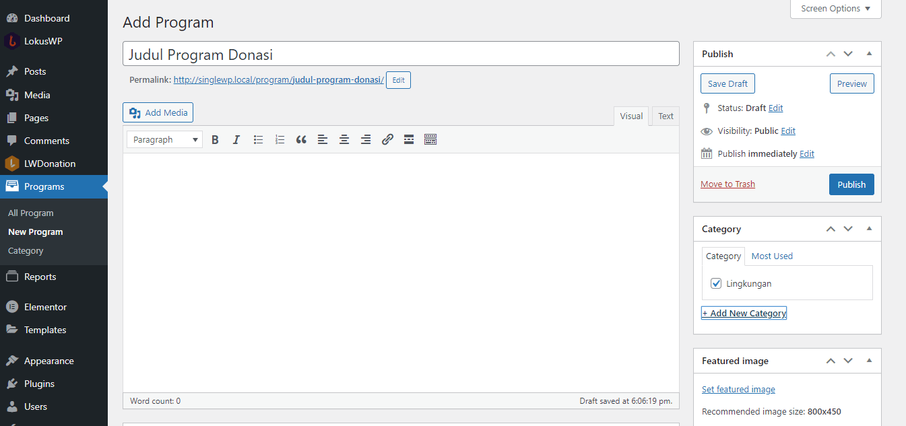

# Cara Buat Program

Berikut ini adalah cara membuat Program Donasi, adapun hal yang harus anda siapkan adalah sebagai berikut ini.

1. Buka **wp-admin** Website Anda.
2. Pilih Menu **Program** dibawah Menu LWDonation
3. Lalu pilih **New Program**

Setelah itu anda akan diarahkan ke halaman pembuatan program baru

1. Masukan Judul Program 
2. Masukan Latar Belakang atau Cerita dari Program yang anda akan buat
3. Masukan Kategori Program jika Belum 
4. Siapkan Thumbnail Program berukuran **800x450**, untuk mendapatkan hasil yang sesuai, gunakan ukuran tersebut

### Data Program

1. Masukan Deskripsi Singat dan Menarik
2. Masukan Minimal Donasi yang Diinginkan
3. Masukan Tulisan untuk di Tombol Donasi
4. Masukan Target Donasi Terkumpul ( Anda bisa kosongkan jika ingin tanpa target )
5. Masukan Deadline Donasi anda ( Anda bisa kosongkan jika ingin tanpa deadline )

### Pencairan Program

1. Masukan Judul Pencairan
2. Masukan Total Pencarian
3. Masukan Tanggal Pencairan
4. Masukan Data Pencairan untuk Sekarang Anda bisa menggunakan | sebagai penanda,
kedepannya akan dibuatkan format, agar data berbentuk tabel, dan otomatis bisa dihitung